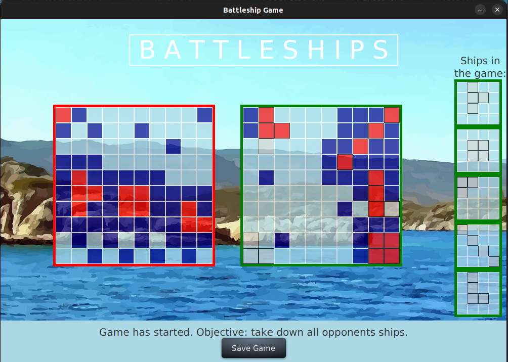
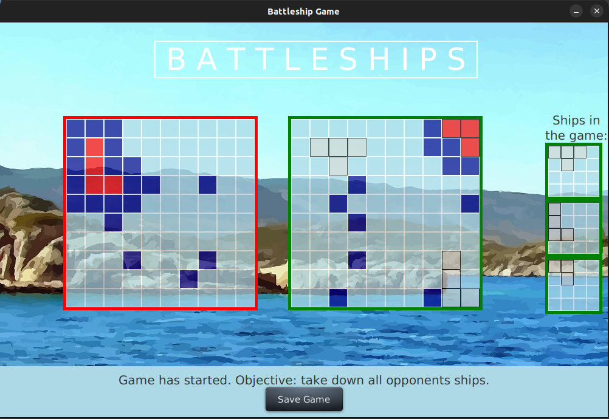
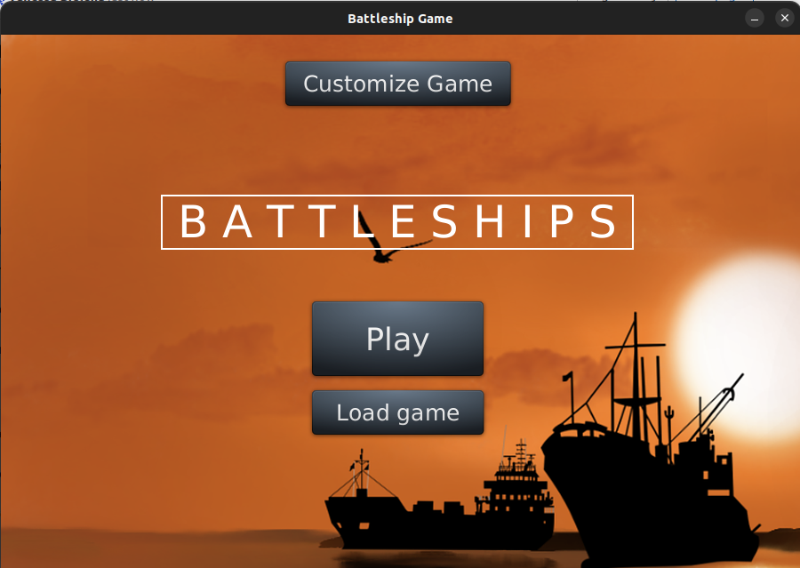
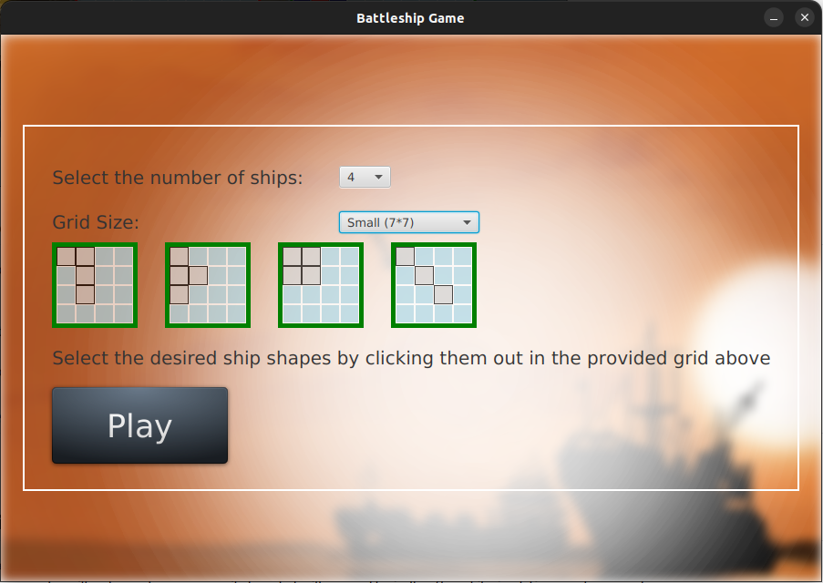
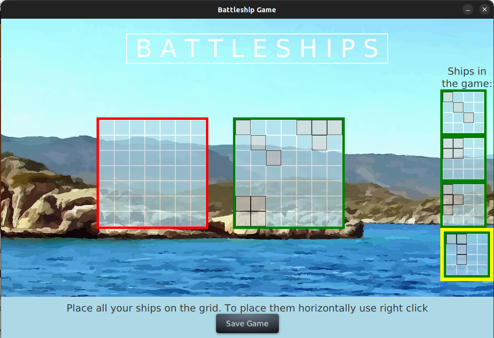

# Battleship Game

A desktop implementation of the classic Battleship game written in Java.

The game allows the player to battle against a computer opponent on a grid-based board. 
Ships are placed on the board and the goal is to sink all enemy ships before the computer sinks yours.

---

## Features

- Player vs Computer gameplay
- Interactive grid-based board
- Custom ship shapes can be selected before starting the game
- Ability to save games and load previously saved games
- Turn-based shooting system
- Visual board interface built with JavaFX

---

## Technologies

- Java
- JavaFX
- Maven

---

## Screenshots
### Game Board

---

## Project Structure

Main parts of the game include:

- `Board` – represents the game board and handles ship placement
- `Ship` – defines ship properties and behavior
- `Square` – represents individual grid squares
- `Game` – main game logic
- `ComputerPlayer` – AI opponent logic
- `HumanPlayer` – player interaction logic
- `Move` – represents a player's move
- `GameData` – stores game state
- `SavedGames` – allows saving and loading games

Unit tests are included for core components such as:

- Board
- Game
- Ship
- Square
